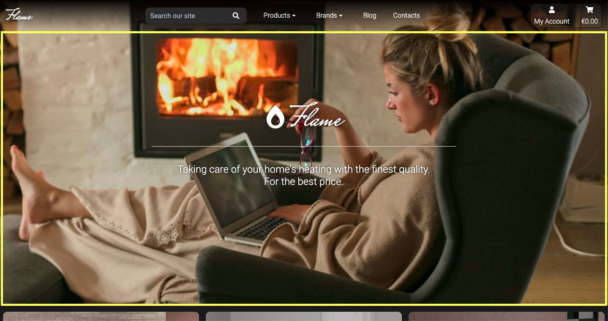
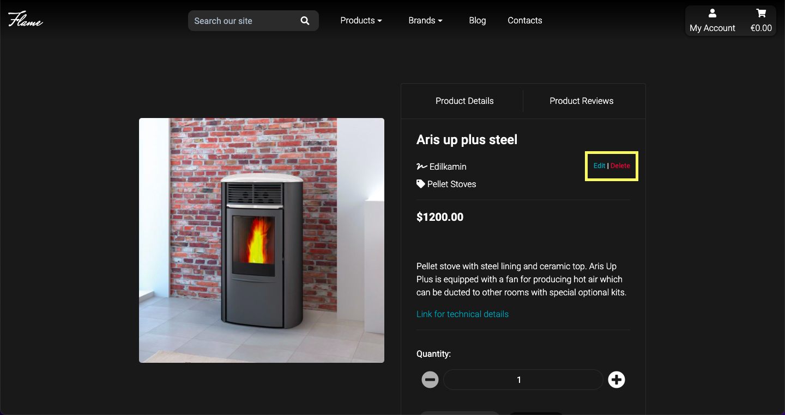

<h1 align="center">Flame - Milestone Project 4</h1>


View the repository on GitHub [here](https://github.com/Hidnish/Milestone-Project-4-Flame)

View the live site [here](https://milestone-project-4-flame.herokuapp.com/)

# Overview

Flame is a fictitious e-commerce website that offers home's heating equipment. This full stack application has been created using the Django framework and was written in HTML, CSS, Javascript and Python. 

Users visiting the site would be able to browse through all products available based on category (pellet, wood and gas stoves) and brand, read and comment on blog posts uploaded by the site administrator, register for an account, write product reviews and contact the company via message. The website is also featured with a payments system using Stripe.

The app administrator is enabled to use CRUD functionality to manage products and blog posts, in addition to having access to the Django's admin section and the database. 

This website is for educational purposes only. Therefore, the Stripe's credit card payment functionality is not set up to accept real payments. Please do not enter any personal credit/debit card numbers while using the site. 

To test the Stripe payment function when making purchases, use the following details: 
- Card Number: 4242 4242 4242 4242
- Date: Any future date
- CVV: Any number

<br>

# Overview

- [User experience](#user-experience)
  * [User Stories](#user-stories)
  * [WireFrames](#wireframes)
  * [Design](#design)
    + [Colour scheme](#colour-scheme)
    + [Typography](#typography)
    + [Images](#images)
    + [Icons](#icons)
- [Features](#features)
  * [Current Features](#current-features)
  * [Future Prospects](#future-prospects)
- [Database](#database)
- [Technologies Used](#technologies-used)
  * [Languages](#languages-used)
  * [Libraries & Integrations](#frameworks-libraries-and-programs)
- [Testing](#testing)
- [Deployment](#deployment)
  * [Set up project locally](#set-up-project-locally)
  * [Deploy to Heroku](#deploy-to-heroku)
  * [AWS Static files storage](#aws-static-files-storage)
  * [Connect Stripe to Heroku](#connect-stripe-to-heroku)
- [Credits](#credits)
  * [Code](#code)
  * [Content](#content)
  * [Media](#media)
  * [Acknowledgements](#acknowledgements)

# User experience

## User Stories

#### As a Customer:

- Website experience:

    1. I want to see what products are being sold on the website.
    2. I want to be able to navigate the website intuitively.
    3. I want to be able to contact the seller.
    4. I want to stay up to date with the latest developments in the sector.
    5. I want to be able to read and add comments on blog posts.

    <br>

- Searching for products:

    6. I want to see all the products the website offers.
    7. I want to be able to search by category.
    8. I want to be able to seatch by brand.
    9. I want to be able to search with a search bar.
    10. I want to be able to sort products by price, name, brand and category.

    <br> 

- Shopping experience:

    11. I want to see the products' price and description.
    12. I want to see other users' reviews and ratings on the products.
    13. I want to be able to add my review on products.
    14. I want to be able to add products to the shopping cart.
    15. I want to be notified when I complete an operation.
    16. I want to be able to edit the content of my shopping cart.
    17. I want to be able to checkout easily.
    18. I want to receive confirmation of my order.

    <br>

- Account:

    19. I want to save my details to a user profile.
    20. I want to be able to see my previous order details.

    <br>

#### As the owner of the Website:

  1. I want to be able to add products with ease.
  2. I want to be able to edit and delete products.
  3. I want to have access to an admin page. 
  4. I want to be able to add, edit and delete posts on the website blog.
  5. I want to be able to delete inappropriate product reviews.
  6. I want to be able to delete inappropriate blog comments.
  7. I want to be able to check contact messages that have been sent site users and mark them as read once they have been taken care of. 

  <br>

## Wireframes <-------------------------->

## Design

#### Colour Scheme

- To give the website a clean and easy-to-read look, different shades of dark grey were chosen as the main color scheme for the application's backgrounds. 

- White and light grey are the main colors used for the text throught the website, except for:
    - 'delete' links:  `#FF5252`
    - 'edit' links:  `#1976D2`
    - Anchor tags (excluding navbar links and footer links):  `#2196F3`


#### Typography

- I used 'Mrs Saint Delafield' as the font for the logo, as a result of its elegance and resemblance to the shape of a flame.
- For the rest of the text on the website, I have used Rotobo, which is easy to read and gives the website a clean and modern appearance. 

#### Imagery

- The products sold on this webiste are based on real products sold by various retailers. For the most part product images have come from [Edilkamin](https://www.edilkamin.com/en/pellet-burning-stove) and other online retailers (credited in the credits section).

- The hero image on the home page has been chosen to the give the site a cozy and comforting appearance. Product category images have been used for the products section in the home page to provide an example of what a product from a specific cateogry may look like.

- Image credits can be found in the credit section of the document.

#### Icons

- I've made use of icons provided by FontAwesome in various sections on the site. They have been used for:
    - Navigation, 
    - Social media links
    - Category and Brand tags
    - Review stars
    - Buttons (i.e. keep shopping, add blog post, etc. )


# Features

- #### All apps 

    - Interactive Navbar features:
        - The site contains the navigation section that is collapsed on smaller size screens in the form of a side navbar accessed by clicking on the hamburger icon.
        - The navbar contains:
          - Webiste logo (which directs to the homepage) on large screen sizes and a 'home' link in the side navbar in smaller screen sizes.
          - Search bar to insert queries and look for specific products
          - Links to the products page (filtering by: category and brand), blog and contact pages
          - Links for account management including: 
            - Profile and Sign out links (for signed in users) 
            - Sign in and sign up links (for unsigned users)
            - Product management, to add new products to the website (for superuser).
          - Link to the shopping cart

          <br>

          <p align="center"></p>
          <p align="center"></p>
    
    
    - Footer features:
        - The footer is split into different sections:
            - Contact: provides company's phone, email contacts and a link to the contact page to message the store owner directly.
            - Shop: provides links to access product list by category.
            - Account: provides links to access blog, profile and signout links (for signed in users) or sign in and sign up links (for unsigned users).
            - Socials: provides links to social medias. 

            <br>

            <p align="center"></p>

    - Toast Messages:
        - Toast message pop-ups are used throughout the site to display feedback to the users as a result of interacting with the site. These messages have a title and a specific color attached to signify different message types:

            - Green: Success
            - Yellow: Warning
            - Blue: Info
            - Red: Errors
        
        <br>

        <p align="center"></p>
    
    - If the user selects to delete a product, comment or review, a modal will show to ask for confirmation to prevent accidental deletion.
        
        <br>

        <p align="center"></p>

- #### Home App

    - Hero-image section features:
        - Upon opening the site the user is greeted with the main hero section that illustrate the purpuse of the website.

        <br>

        <p align="center"></p>
        
    - Product Categories section features:
        - The product categories sections with three links to access the product page filtering products by specific category.

        <br>

        <p align="center"></p>
        
    - Blog section features:
        - Slideshow with all blog posts that users can browse through by scrolling sideways or by clicking on the right/left chevron icons.
        - The user can click on the 'Flame' logo to be led to the blog page and click on the post titles to be led to the specific blog post page.

        <br>

        <p align="center"></p>

- #### Products App

    - All Products page features:
        - Shows all the products available in the store 
        - The user can filter the product displayed by clicking the respective links in the navigration bar or by searching for product: name, brand, category or description though the search bar.

        <br>
        
        <p align="center"></p>

        - Select-input in the top right corner of the page that allows users to sort through products.

        <br>

        <p align="center"></p>

    - Product detail page features:
        - Product image 
        - Product detail section consisting of:
          - Product description (admin will also be able to edit and delete products by clicking on the respective links)
          - Quantity selector and an add to cart button
          - Link to go back to the products page
        - Product reviews section consisting of:
          - Average rating by users 
          - Button to add a review (for signed in users) or link to sign in/ sign up for unsigned Users
          - List of reviews and ratings by users
          - Button only visible on a user's own reviews to delete them

        <br>

        <p align="center"></p>

        <p align="center"></p>

        - Related products section that allows the user to browse through the related products' slideshow (in the same category of the selected product) by scrolling through or clicking on the left/right chevron arrows.

        <br>

        <p align="center"></p>
    
    - Adding products to the Cart:
        - The user has the option to add items to the cart from the products page by clicking on the respective button.
        - The user will then be shown a toast message showing that the product has been placed in the cart with a list of all items already present in the cart and a link to redirect to the cart page.

        <br>

        <p align="center"></p>

    - Restricted to superuser:
        - The 'all products' and 'product detail' page provides links to the edit page or to delete a product.
        
        - The review section in the 'product detail' page provides buttons to delete any review 

        <br>

        <p align="center"></p>

        - Via link in the 'my account' section on the navbar, the user has access to the product management page to add items directly from the website.

        <br>

        <p align="center"></p>

- #### Cart App

    - Cart Page features:
        - List of products that have been placed in their cart.
            - The user can adjust the quantity of each product, or remove it from the cart.
        - Total, delivery price, and grand total.
        - Buttons that link to checkout page (1) and back to the product page to continue shopping (2).

        <br>

        <p align="center"></p>

- #### Checkout app

    - Checkout page features:
        - Checkout form (with save-info option for signed in users).
        - Order summary with: 
            - Products image
            - Product name
            - Price per unit
            - Quantity
            - Subtotal
        - Buttons to complete checkout (1) and return to shopping cart (2)

        <br>
        
        <p align="center"></p>

        <p align="center"></p>
    
    - Order confirmation page features:
        - Once the order has been confirmed the user is directed to the order confirmation page that will display the order details and order number.
        - An email of confirmation will be sent to the user.

        <br>

        <p align="center"></p>

- #### Profiles app
    - Profile page features:
        - Users' shipping details to pre-fill checkout forms.
        - List with past orders. 

        <br>

        <p align="center"></p>

        - When the users click on an order number from the profile page, they are directed to the order's detail page (same as the one created after a successful checkout).

        <br>

        <p align="center"></p>

- #### Blog app

    - Blog page features: 
        - The main blog page shows all the blog posts created with a link to each specific blog post.

        <br>

        <p align="center"></p>

    - Blog post page features: 
        - Post with description and link to be redirected to the main blog page 
        - Comment section to which signed in users can add comments.

        <br>

        <p align="center"></p>
    
    - Restricted to superuser:
        - The blog page provides the user with a link (a plus icon) that redirects to the form page where the superuser can add a new post.
        - The blog post page provides buttons to edit (1) and delete (2) the post. 

        <br>

        <p align="center"></p>

- #### Contact App

    - Contact page features:
        - Contact form that allows users to send a message to the store owner directly from the website (with email field pre-filled for signed in users).

        <br>

        <p align="center"></p>

- ### Allauth features
    - The sign in, sign up, sign out, password reset, email confirmation and other authentication related features, have been provided by Django allauth and edited to fit with the style and functionality of the website.


## Future Prospects 

- Functionality to sort products by rating. 
- Log in and registration via social media account. 
- Functionality to 'save' products to a wishlist. 
- Allow users to delete their account.
- Allow users to subscribe to a newsletter. 


# Database

- The SQLite relational DBMS has been used in development to store the data for the project. 
- PostgreSQL relational DBMS has been used in production. 

## Models

- Users
  - User
    - From Django Allauth containing the username, email, and password.
  - UserProfile
    - Model containing the user's details for future orders.

- Products 
  - Product
    - Contains the information for each product item.
  - Category
    - The categories for the Products.
  - Brand 
    - The brands for the Products.
  - Review
    - Contains rating and text for product reviews.

- Contacts
  - Message
    - Contains the details of the messages from the contact form.

- Shopping
  - Order
    - Contains details of the customer's orders, delivery info and the products they've ordered.
  - OrderlineItem
    - Porducts in the customer's order with quantity and total.

- Blog
  - BlogPost
    - Contains the blog post and details of its author and title.
  - Comments
    - Contains the comments for each post.


## Database Schema

  - The database diagram shows the fileds contained in the models and relationships between each object.

    

# Technologies Used

## Languages 

- [HTML](https://en.wikipedia.org/wiki/HTML5)
- [CSS](https://en.wikipedia.org/wiki/Cascading_Style_Sheets) 
- [JavaScript](https://en.wikipedia.org/wiki/JavaScript)
- [Python](https://www.python.org/)

## Libraries & Integrations
- [Django](https://www.djangoproject.com/)
    - Used as the primary framework to build the project.
- [Django Crispy Forms](https://django-crispy-forms.readthedocs.io/en/latest/)
    - Used to render the forms on the site.
- [Django Allauth](https://django-allauth.readthedocs.io/en/latest/index.html)
    - Used for user authentication on the site.
- [Django Countries](https://pypi.org/project/django-countries/)
    - Used to populate the countries select field on the order form and profile form.
- [Coverage](https://pypi.org/project/coverage/)
    - Used to produce a testing report.
- [Stripe](https://stripe.com/gb)
    - Used to handle payments.
- [Bootstrap](https://getbootstrap.com/)
    - Used as a framework for styling and to make the site responsive via grid system.
- [Amazon Web Services](https://aws.amazon.com/)
    - Used to store static files and images.
- [SQLite](https://www.sqlite.org/index.html)
    - Database used in development.
- [PostgreSQL](https://www.postgresql.org/)
    - Database used in production.
- [Heroku](https://id.heroku.com/login)
    - Online Cloud Platform used to deploy the live site.
- [Gunicorn](https://gunicorn.org/)
    - Used for deploying the project to Heroku.
- [Fontawesome](https://fontawesome.com/)
    - Used for icons across the website. 
- [Google Fonts](https://fonts.google.com/)
    - Used to import "Roboto" & "Mrs Saint Delafield" fonts used across the website. 
- [jQuery](https://jquery.com/)
    - Used to simplify JavaScript code. 
- [Balsamiq](https://balsamiq.com/)
    - Used to create the wireframes for the project. 
- [Lucidchart](https://www.lucidchart.com) 
    - Used to create the database schema illustration.
- [Github](https://github.com/)
    - Used to store the project code after being pushed from Git.
- [Git](https://git-scm.com/) 
    - Used for version control to commit to Git and Push to GitHub.
- [Glider.js](https://nickpiscitelli.github.io/Glider.js/)
    - Used to create slider to display and browse through blog posts and recommended products.


# Testing

- The testing section for this site is located at the following link:
    - [Testing file](TESTING.md)


# Deployment

## Set up project locally

First, ensure the following are set up on your IDE:
- [PIP3](https://pypi.org/project/pip/) Python package installer. 
- [Python 3.6](https://www.python.org/downloads/release/python-360/) or higher.
- [Git](https://git-scm.com/) version control.

To clone the project up locally you can follow the following steps: 

1. Navigate to the repository - [Flame Repository](https://github.com/Hidnish/Milestone-Project-4-Flame)

2. Click the code dropdown button and copy the url. 

3. Open the terminal in your IDE and enter the following code: 
    - ```
        git clone https://github.com/Hidnish/Milestone-Project-4-Flame.git
        ```

4. Install the dependencies needed to run the application by typing the following command into the terminal: 
    - ```
        pip3 install -r requirements.txt
        ```

5. Create a Stripe account,if you do not have one yet, to allow online purchases in your website. 

6. Set up the environment variables: 
    - Create an env.py file (make sure to add the file to .gitignore to avoid exposure of sensitive data) by typing the following command into the terminal:
        - ```
            touch env.py
            ```
    - Inside the env.py file add the following code:
        - ```
            import os

            os.enviorn["DEVELOPMENT"] = True
            os.environ["SECRET_KEY"] = "Your secret key"
            os.environ["STRIPE_PUBLIC_KEY"] = "Your stripe public key"
            os.environ["STRIPE_SECRET_KEY"] = "Your stripe secret key"
            os.environ["STRIPE_WH_SECRET"] = "Your stripe webhook secret key"
            ```

    - Your stripe variables can be found on your stripe dashboard. 
    - You can generate the "SECRET_KEY" at [Djcrety](https://djecrety.ir/)

7. To set up the database migrate the database models by typing the following commands into the terminal: 
    - ```
        python3 manage.py showmigrations
        python3 manage.py makemigrations
        python3 manage.py migrate
        ```

8. To load the product fixtures into the database type the following commands into the terminal:
    - ```
        python3 manage.py loaddata products
        python3 manage.py loaddata categories
        python3 manage.py loaddata brands
        ```

9. Create a superuser to have access to the django admin dashboard type the following commands into the terminal:
    - ```
        python3 manage.py createsuperuser
        ```
    - Then set up the account by adding your username, email and password. 

10. Finally, run the app locally by typing the following command into the terminal: 
    - ```
        python3 manage.py runserver
        ```


## Deploy to Heroku

1. Create a Heroku app: 
    - Go to [Heroku](https://www.heroku.com/) and create an account if you do not have one yet. 
    - From the dashboard click on 'new app' button, name your app and choose the region closest to you. 
    - On the resources tab set up a new Postgres database by searching for 'Postgres'.
2. On your IDE, install 'dj_database_url' & 'psycopg2' to enable the use of the Postgres database: 
    - In the terminal type the following commands:
        - ```
            pip3 install dj_database_url
            pip3 install psycopg2-binary
            ```
3. Add the downloaded dependencies to the requirements file:
    - ```
        pip3 freeze > requirements.txt
        ```
4. To setup the new database go to to settings.py, import 'dj_database_url', comment out the default database configuration and replace the default database with the following: 
    - ```
        import dj_database_url

        DATABASES = {
            'default': dj_database_url.parse("The URL of your Heroku Postgres database")
        }
        ```
5. Run all migrations to the new Postgres database by entering the following command in the terminal:
    - ```
        python3 manage.py migrate
        ```
6. Load the product data from the fixture files into the new database: 
    - ```
        python3 manage.py loaddata products
        python3 manage.py loaddata categories
        python3 manage.py loaddata brands
        ```
7. Create a superuser by typing the following command into the terminal:
    - ```
        python3 manage.py createsuperuser
        ```
    - Then set up the account by adding your username, email and password. 
8. In settings.py set up the following to use the Postgres database when the app is running on Heroku and the SQLite3 when the app is running locally:
    - ```
        if 'DATABASE_URL' in os.environ:
            DATABASES = {
                'default': dj_database_url.parse(os.environ.get('DATABASE_URL'))
            }
        else:
            DATABASES = {
                'default': {
                    'ENGINE': 'django.db.backends.sqlite3',
                    'NAME': BASE_DIR / 'db.sqlite3',
                }
            }
        ```
9. Install Gunicorn (which will act as our webserver) by typing the following commands into the terminal:
    - ```
        pip3 install gunicorn
        pip3 freeze > requirements.txt
        ```
10. Create a procfile by typing the following command into the terminal:
    - ```
        touch Gunicorn
        ```
11. Type the following into the procfile: 
    - ```
        web: gunicorn flame.wsgi:application
        ```
12. Log in into the Heroku terminal:
    - ```
        heroku login -i
        ```
13. Disable collectstatic to prevent Heroku from collecting static files when deployed, by typing the following command into the terminal: 
    - ```
        heroku config:set DISABLE_COLLECTSTATIC=1 --app "heroku_app_name"
        ```
14. In settings.py add the hostname of the Heroku app, and allow localhost: 
    - ```
        ALLOWED_HOSTS = ['"heroku_app_name".herokuapp.com', 'localhost']
        ```
15. Deploy to Heroku by typing the following commands into the terminal: 
    - ```
        heroku git:remote -a "heroku_app_name"
        git push heroku master
        ```
16. To set up automatic deployments in Heroku when pushing code to github:
    - On the deploy tab, connect to github by searching for the repository name and clicking 'Connect'.
    - Click 'Enable Automatic Deploys" 
17. Generate a django secret key at [Djcrety](https://djecrety.ir/) and add it to 'Settings' > 'Config variables' in Heroku.
18. Update the settings.py file to collect the secret key from the environment, and use an empty string as default: 
    - ```
        SECRET_KEY = os.environ.get('SECRET_KEY', '')
        ```
19. Set debug to be true only if there's a variable called "DEVELOPMENT" in the environment. 
    - ```
        DEBUG = 'DEVELOPMENT' in os.environ
        ```

## AWS Static files storage

### Create a New Bucket

1. Go to to [Amazon AWS](https://aws.amazon.com/) and sign in/sign up. 
2. From the 'Services' tab on the AWS Management Console, search 'S3' and select it.
3. Click the 'Create a new bucket' button: 
    - Enter a bucket name (recommended to be the same name as the Heroku App) and a region (enter the region that is closest to you)
    - Uncheck the "Block all public access" checkbox and confirm that the Bucket will be public.
    - Click the "Create bucket" button. 
4. Change settings by clicking on the bucket that appears: 
    - Click the 'Properties' tab and turn on static website hosting.
    - Fill in index.html and error.html as default.
    - Click the 'permission' tab and make the following changes:
        1. Set the CORS configuration to: 
            - ```
                [
                    {
                        "AllowedHeaders": [
                            "Authorization"
                        ],
                        "AllowedMethods": [
                            "GET"
                        ],
                        "AllowedOrigins": [
                            "*"
                        ],
                        "ExposeHeaders": []
                    }
                ]
                ```
        2. Go to the Bucket Policy tab and click 'Edit' > 'Policy Generator':
            - Select the following options:
                - Policy Type: "S3 Bucket Policy"
                - Principal: "*"
                - Actions: "GetObject"
                - ARN: Copy the ARN from the permissions tab
            - Copy the JSON document from the new policy into the Bucket Policy editor. 
            - Add a "/*" to the end of the resource key to allow access to all resources in this bucket.
            - Click the "Save" button. 
        3. Go to the 'Access Control List' section, and set the object permission to 'Everyone'.

### Create AWS Groups, Policies and Users

1. From the services menu go to IAM.
2. From the Access Management dropdown select 'User Groups'. 
    - Click the 'Create New Group" button
    - Name your group (associated with the S3 Bucket name)
    - Click 'Next' until the last page, then click the 'Save' button. 
3. From the Access Management dropdown select 'Policies'
    - Click the 'Create Policy' button: 
        - Go to the JSON tab and click 'Import Managed Policy'
        - Search for S3 then select 'AmazonS3FullAccess' and click "Import".
        - Get the ARN from the S3 bucket policy page and paste it in the "Resource" field as a list. Add two ARN's, one for the bucket itself and another for all files and folders in the bucket ("/*" at the end of the string): 
            - ```
                {
                    "Version": "2012-10-17",
                    "Statement": [
                        {
                            "Effect": "Allow",
                            "Action": [
                                "s3:*",
                                "s3-object-lambda:*"
                            ],
                            "Resource": [
                                "arn:aws:s3:::milestone-project-4-flame",
                                "arn:aws:s3:::milestone-project-4-flame/*"
                            ]
                        }
                    ]
                }
                ```
        - Click the "Review Policy" button and give the policy a name and description and click the "Create Policy" button.
4. Go back to the "User Groups" page:
    - Click the group you want to attach the policy to and click "Attach policy" 
    - Search for the policy that has been created and attach it.
5. From the Access Management dropdown click "Users" > "Add Users" : 
    - Enter a user name and select the "Programmatic access' checkbox and select next
    - On the next page add the user to the group that was created and click through the end to create the user. 
    - Once the user is created download the CSV file containing the user's access key and secret access key (needed to authenticate the user from the Django app). 

### Connect Django to S3

1. To connect the S3 bucket to django install the following packages and add them to the requirements file:
    - ```
        pip3 install boto3
        pip3 install django_storages
        ```
       ```
        pip3 freeze > requirements.txt
        ```
    - Add (Django) storages to the list of INSTALLED_APPS in settings.py.

2. Update the settings.py file to tell Django which bucket it should be communicating with. To run this only on Heroku, add an if statement to check if theres an environment variable called USE_AWS: 
    - ```
        if 'USE_AWS' in os.environ:
            AWS_STORAGE_BUCKET_NAME = 'milestone-project-4-flame'
            AWS_S3_REGION_NAME = 'eu-north-1'
            AWS_ACCESS_KEY_ID = os.environ.get('AWS_ACCESS_KEY_ID')
            AWS_SECRET_ACCESS_KEY = os.environ.get('AWS_SECRET_ACCESS_KEY')
            AWS_S3_CUSTOM_DOMAIN = f'{AWS_STORAGE_BUCKET_NAME}.s3.amazonaws.com'

            STATICFILES_STORAGE = 'custom_storages.StaticStorage'
            STATICFILES_LOCATION = 'static'
            DEFAULT_FILE_STORAGE = 'custom_storages.MediaStorage'
            MEDIAFILES_LOCATION = 'media'

            STATIC_URL = f'https://{AWS_S3_CUSTOM_DOMAIN}/{STATICFILES_LOCATION}/'
            MEDIA_URL = f'https://{AWS_S3_CUSTOM_DOMAIN}/{MEDIAFILES_LOCATION}/'
        ```
    - In Heroku update the config variables: 
        - USE_AWS =  True 
        - AWS_ACCESS_KEY_ID = From the IAM user's data CSV file
        - AWS_SECRET_ACCESS_KEY = From the the IAM user's data CSV file
    - Remove the DISABLE_COLLECTSTATIC variable to allow django to collect static files and upload them to S3. 
3. Create a custom_storages.py file to tell Django we want to use s3 to store our static and media files in production:
    - ```
        from django.conf import settings
        from storages.backends.s3boto3 import S3Boto3Storage


        class StaticStorage(S3Boto3Storage):
            location = settings.STATICFILES_LOCATION


        class MediaStorage(S3Boto3Storage):
            location = settings.MEDIAFILES_LOCATION
        ```
4. In the S3 bucket create a new folder called 'media':
    - Inside the media folder click "Upload" > "Add files" and select all the products, blog and other images
    - Select 'Grant public read access to these objects' 
    - Click through to 'upload'. 

## Connect Stripe to Heroku

1. Sign in/Sign up to [Stripe](https://stripe.com/gb) 
2. From the dashboard go to 'Developer' > 'API Keys'. Copy the public and secret keys and add them to Heroku config variables:
    - STRIPE_PUBLIC_KEY = Public key from Stripe
      STRIPE_SECRET_KEY = Secret ket from Stripe
3. Add a new webhook endpoint:
    - Go to 'Webhooks' in the developers menu on stripe and click the 'Add endpoint' button: 
    - Add the endpoint as the Heroku app's URL followed by "checkout/wh/", and select 'Receive all events': 
        - ```
            https://milestone-project-4-flame.herokuapp.com/checkout/wh/
            ```
4. Copy the signing secret for the webhook and add it to the heroku config variables: 
    - STRIPE_WH_SECRET = Secret webhook ket from Stripe 


# Credits

## Code

- [Code Institute: Boutique Ado](https://codeinstitute.net/): Code institutes Boutique Ado app provided the building blocks for the project and was used as a primary resource.

- [Code Artisan Lab: Django Products Reviews](https://www.youtube.com/watch?v=7tyMyLCjKVg&t=1267s&ab_channel=CodeArtisanLab): This youtube walkthrough help me to set up the product reviews and blog comments functionalities using jquery ajax.

- [Code Artisan Lab: Django Products Reviews #2](https://www.youtube.com/watch?v=7tyMyLCjKVg&t=1267s&ab_channel=CodeArtisanLab): This youtube walkthrough help me to set up the product reviews and blog comments functionalities using jquery ajax.

- [frontendfunn: Side Navbar](https://github.com/frontendfunn/bootstrap-4-sidebar): The code from this repository helped me to create a side navbar for small screen sizes using boostrap 4. 

- [Newbedev: Dropdown Slide](https://newbedev.com/adding-a-slide-effect-to-bootstrap-dropdown): I used code from this source to add a sliding animation to dropdown menus.

- [BrianWhelanDublin: milestone-project-4](https://github.com/BrianWhelanDublin/milestone-project-4): The code from this repository has been used as a point of refenrece to perfom Django automated testing. 


## Content

- Products Info:
    - [Edilkamin](https://www.edilkamin.com/en/pellet-burning-stove)
    - [Piazzetta](https://www.piazzetta.com/en/)
    - [Italia Camini](https://www.italianacamini.it/)
    - [Invicta](https://www.invicta.fr/en/)

- Blog Posts:
    - [Fire Place Universe](https://fireplaceuniverse.com/pellet-stoves-environmentally-friendly/)
    - [Iberdrola](https://www.iberdrola.com/sustainability/what-is-reforestation)
    - [Palazzetti](https://palazzettigroup.com/company/italian-design/)

## Media

- Products Images:
    - [Edilkamin](https://www.edilkamin.com/en/pellet-burning-stove)
    - [Piazzetta](https://www.piazzetta.com/en/)
    - [Italia Camini](https://www.italianacamini.it/)
    - [Invicta](https://www.invicta.fr/en/)

- Hero Image:
    - [Sintef](https://blog.sintef.com/sintefenergy/these-simple-tips-will-help-you-reduce-your-wood-burning-stoves-environmental-footprint-with-video/)

- Blog images:
    - [Unisplash](https://unsplash.com/)

## Acknowledgements

- My Mentor Antonio Rodriguez for his help and support with this project.
- Slack community for trubleshooting and FAQ.
- The entire Code Institute staff for this incredible journey.
