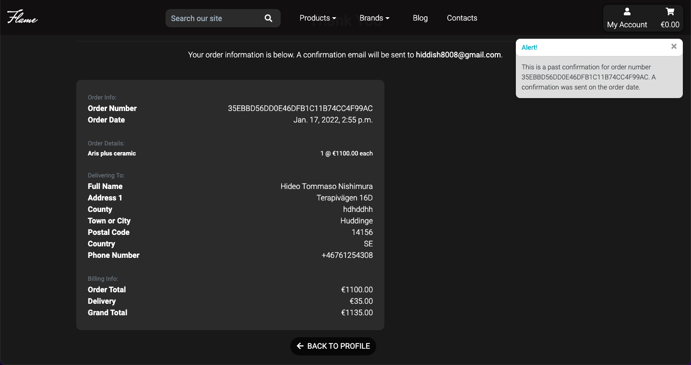

## User experience

### User Stories

- As a Customer:

  - Website experience:
    - I want to see what products are being sold on the website.
    - I want to be able to navigate the website intuitively.
    - I want to be able to contact the seller.
    - I want to stay up to date with the latest developments in the sector.
    - I want to be able to read and add comments on the blog posts.
  
  - Searching for products:
    - I want to see all the products the website offers.
    - I want to be able to search by category.
    - I want to be able to seatch by brand.
    - I want to be able to search with a search bar.
    - I want to be able to sort products by price, name, brand and category.

  - Shopping experience:
    - I want to see the products' price and description.
    - I want to see other users' reviews and ratings on the products.
    - I want to be able to add my review on products.
    - I want to be able to add products to the shopping cart.
    - I want to be notified when I complete an operation.
    - I want to be able to edit the content of my shopping cart.
    - I want to be able to checkout intuitively.
    - I want to receive confirmation of my order.

  - Account:
    - I want to save my details to a user profile.
    - I want to be able to see my previous order details.

- As the owner of the Website:

  - I want to be able to add products with ease.
  - I want to be able to edit and delete products.
  - I want to have access to an admin page. 
  - I want to be able to add, edit and delete posts on the website blog.
  - I want to be able to delete inappropriate product reviews.
  - I want to be able to delete inappropriate blog comments.
  - I want to be able to check contact messages that have been sent site users and mark them as read once they have been taken care of. 

## Features

- #### All apps 

    - Interactive Navbar features:
        - The site contains the navigation section that is collapsed on smaller size screens in the form of a side navbar accessed by clicking on the hamburger icon.
        - The navbar contains:
          - Webiste logo (which directs to the homepage) on large screen sizes and a 'home' link in the side navbar in smaller screen sizes.
          - Search bar to insert queries and look for specific products
          - Links to the products page (filtering by: category and brand), blog and contact pages
          - Links for account management including: 
            - Profile and Sign out links (for signed in users) 
            - Sign in and sign up links (for unsigned users)
            - Product management, to add new products to the website (for superuser).
          - Link to the shopping cart
          - 

    
    - Footer features:
        - The footer is split into different sections:
            - Contact: provides company's phone, email contacts and a link to the contact page to message the store owner directly.
            - Shop: provides links to access product list by category.
            - Account: provides links to access blog, profile and signout links (for signed in users) or sign in and sign up links (for unsigned users).
            - Socials: provides links to social medias. 

    - Toast Messages:
        - Toast message pop-ups are used throughout the site to display feedback to the users as a result of interacting with the site. These messages have a title and a specific color attached to signify different message types:

            - Green: Success
            - Yellow: Warning
            - Blue: Info
            - Red: Errors
    
    - If the user selects to delete a product, comment or review, a modal will show to ask for confirmation to prevent accidental deletion.
        -  

- #### Home App

    - Hero-image section features:
        - Upon opening the site the user is greeted with the main hero section that illustrate the purpuse of the website.
            - 

        
    - Product Categories section features:
        - The product categories sections with three links to access the product page filtering products by specific category.
            - 

        
    - Blog section features:
        - Slideshow with all blog posts that users can browse through by scrolling sideways or by clicking on the right/left chevron icons.
        - The user can click on the 'Flame' logo to be led to the blog page and click on the post titles to be led to the specific blog post page.
            - 

- #### Products App

    - All Products page features:
        - Shows all the products available in the store 
        - The user can filter the product displayed by clicking the respective links in the navigration bar or by searching for product: name, brand, category or description though the search bar.
            - 

        - Select-input in the top right corner of the page that allows users to sort through products.
            - 

    - Product detail page features:
        - Product image 
        - Product detail section consisting of:
          - Product description (admin will also be able to edit and delete products by clicking on the respective links)
          - Quantity selector and an add to cart button
          - Link to go back to the products page
        - Product reviews section consisting of:
          - Average rating by users 
          - Button to add a review (for signed in users) or link to sign in/ sign up for unsigned Users
          - List of reviews and ratings by users
          - Button only visible on a user's own reviews to delete them
            -  

        - Related products section that allows the user to browse through the related products' slideshow (in the same category of the selected product) by scrolling through or clicking on the left/right chevron arrows.
    
    - Adding products to the Cart:
        - The user has the option to add items to the cart from the products page by clicking on the respective button.
        - The user will then be shown a toast message showing that the product has been placed in the cart with a list of all items already present in the cart and a link to redirect to the cart page.
        -  

    - Restricted to superuser:
        - The 'all products' and 'product detail' page provides links to the edit page or to delete a product.
            -  

        
        - The review section in the 'product detail' page provides buttons to delete any review 

        - Via link in the 'my account' section on the navbar, the user has access to the product administration page to add items directly from the website.
            -  

- #### Cart App

    - Cart Page features:
        - List of products that have been placed in their cart.
            - The user can adjust the quantity of each product, or remove it from the cart.
        - Total, delivery price, and grand total.
        - Buttons that link to checkout page (1) and back to the product page to continue shopping (2).
            -  

- #### Checkout app

    - Checkout page features:
        - Checkout form (with save-info option for signed in users).
        - Order summary with: 
            - Products image
            - Product name
            - Price per unit
            - Quantity
            - Subtotal
        - Buttons to complete checkout (1) and return to shopping cart (2)
            -  

    
    - Order confirmation page features:
        - Once the order has been confirmed the user is directed to the order confirmation page that will display the order details and order number.
        - An email of confirmation will be sent to the user.
            -  

- #### Profiles app
    - Profile page features:
        - Users' shipping details to pre-fill checkout forms.
        - List with past orders. 
            -  

        - When the users click on an order number from the profile page, they are directed to the order's detail page (same as the one created after a successful checkout).
            -  

- #### Blog app

    - Blog page features: 
        - The main blog page shows all the blog posts created with a link to each specific blog post.
            - 

    - Blog post page features: 
        - Post with description and link to be redirected to the main blog page 
        - Comment section to which signed in users can add comments.
    
    - Restricted to superuser:
        - The blog page provides the user with a link (a plus icon) that redirects to the form page where the superuser can add a new post.
        - The blog post page provides buttons to edit (1) and delete (2) the post. 
            - 

- #### Contact App

    - Contact page features:
        - Contact form that allows users to send a message to the store owner directly from the website (with email field pre-filled for signed in users).

- ### Allauth features
    - The sign in, sign up, sign out, password reset, email confirmation and other authentication related features, have been provided by Django allauth and edited to fit with the style and functionality of the website.

